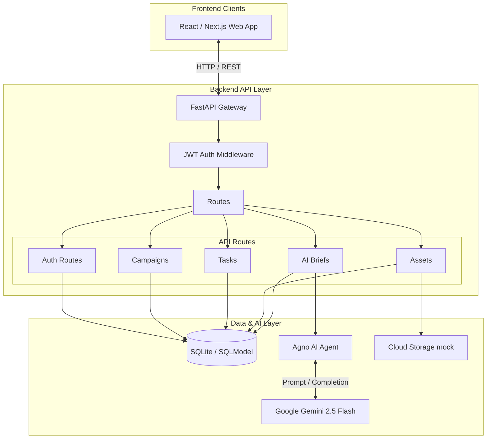
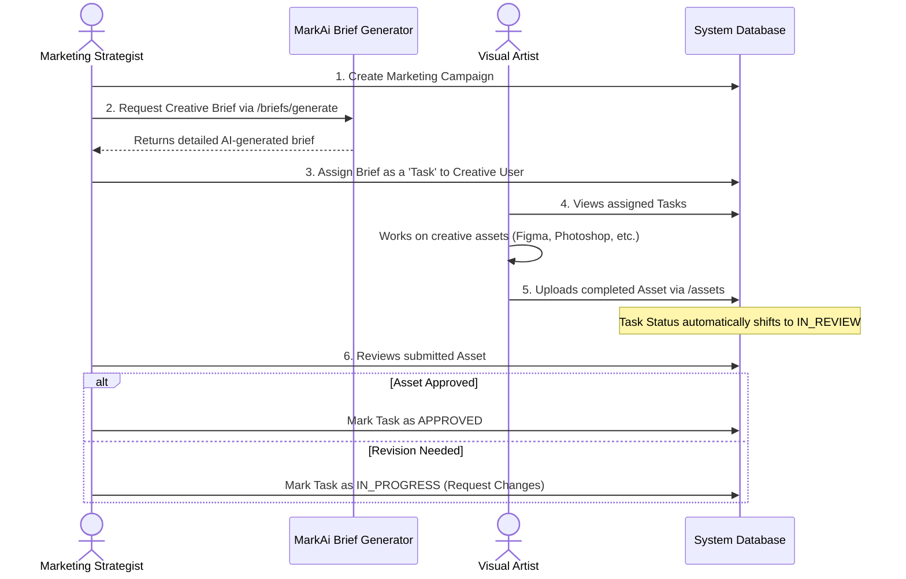
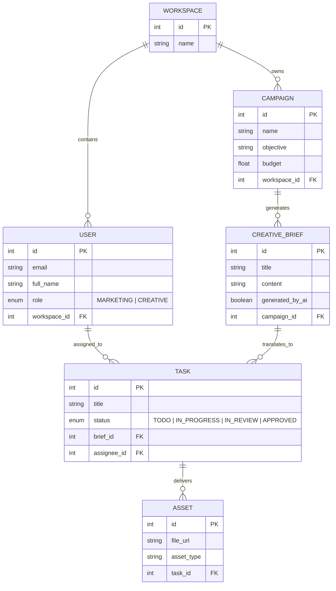

<div align="center">
  <h1>✨ MarkAi</h1>
  <p><strong>The AI-Augmented Collaborative Platform for Marketing & Creative Teams</strong></p>

  <p>
    
    
    
    
  </p>
</div>

---

## 📖 Overview

**MarkAi** is a modern, human-in-the-loop marketing operations platform designed to bridge the gap between **Marketing Strategists** and **Visual Artists**. 

By replacing fully autonomous, black-box AI with targeted, on-demand AI assistants, MarkAi accelerates the creative pipeline. Marketing teams can instantly generate structured creative briefs using AI, and seamlessly assign them as production tasks to visual artists in a unified, collaborative workspace.

## 🚀 Key Features

* **👥 Role-Based Workspaces**: Dedicated flows for `Marketing` (Strategy & Approval) and `Creative` (Production & Delivery).
* **📊 Campaign Management**: Define campaign objectives, target audiences, and budgets in a centralized hub.
* **🤖 AI Studio (Brief Generation)**: Leverage **Google Gemini** (via Agno) to instantly transform high-level campaign goals into detailed, structured creative briefs.
* **📋 Task Pipeline**: Assign AI-generated or manual briefs directly to visual artists as trackable production tasks.
* **✅ Review & Approvals**: Creatives upload digital assets directly to their tasks, automatically triggering an `IN_REVIEW` status for marketing directors to approve.

---

## 🏛️ System Architecture

MarkAi is built on a modern, asynchronous Python stack designed for speed and scalability.



---

## 🔄 Core Collaborative Workflow

The core value of MarkAi is the seamless handoff between the strategic team (Marketing), the AI Assistant, and the production team (Visual Artists).



---

## 🗄️ Database Schema (Entity-Relationship)

The system uses a strictly typed relational schema managed by SQLModel (Pydantic + SQLAlchemy). 



---

## 🛠️ Getting Started

### 1. Prerequisites
* Python 3.11 or higher
* [Optional] A Google Gemini API Key for AI features

### 2. Installation

Clone the repository and set up a virtual environment:

```bash
# Create and activate virtual environment
python3 -m venv venv
source venv/bin/activate  # On Windows use `venv\Scripts\activate`

# Install dependencies
pip install -e .
pip install sqlmodel passlib[bcrypt] python-jose pydantic[email] python-multipart
```

### 3. Environment Variables

Create a `.env` file in the root directory (or update the existing one) and add your AI credentials:

```env
GOOGLE_API_KEY=your_gemini_api_key_here
```

### 4. Running the Server

Start the FastAPI backend with hot-reloading:

```bash
uvicorn brandforge.api.app:app --reload --port 8000
```

### 5. API Documentation

Once the server is running, the interactive API documentation is automatically generated. Visit:
👉 **[http://localhost:8000/docs](http://localhost:8000/docs)** 

---

## 📂 Project Structure

```text
src/brandforge/
├── agents/             # Targeted AI assistants (e.g., brief_generator.py)
├── api/
│   ├── middleware/     # Auth and Role-Based Access Control (RBAC)
│   ├── routes/         # REST endpoints (auth, campaigns, briefs, tasks, assets)
│   └── app.py          # FastAPI application factory & DB initialization
├── db/                 # SQLModel database engine and session management
└── models/             # Relational data models (Users, Campaigns, Tasks, etc.)
```
