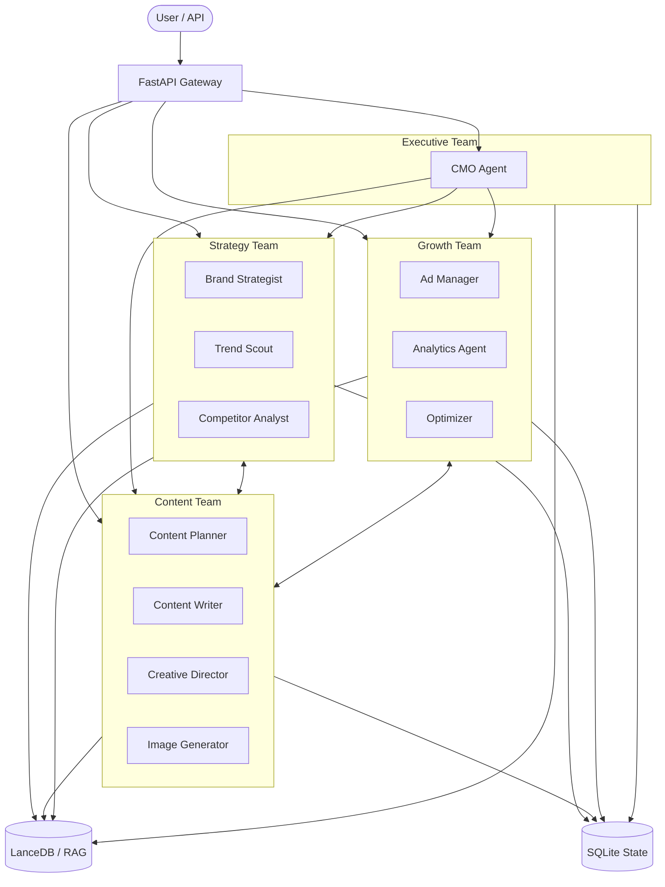

# 🚀 BrandForge AI
### AI-Powered Brand Growth & Marketing Automation Platform


## Overview

BrandForge AI is a cutting-edge multi-agent marketing automation system built on the AGNO framework. It acts as an autonomous virtual marketing department that can analyze markets, plan strategies, create content, run ad campaigns, and optimize performance. Designed for scalability and intelligence, it takes marketing from manual labor to data-driven, AI-led execution.

## Architecture



## Agent Roster

| Agent Name | Role | Capabilities & Tools |
|------------|------|-----------------------|
| **CMO** | Chief Marketing Officer | Orchestrates marketing vision, resolves conflicts, prioritizes ROI (ReasoningTools, RAG) |
| **Brand Strategist** | Brand Strategy Specialist | Defines positioning, audience segments, tone of voice (RAG, FileTools) |
| **Trend Scout** | Trend & Opportunity Analyst | Monitors trends, viral patterns, news (DuckDuckGo, Tavily, Crawl4ai) |
| **Competitor Analyst** | Competitive Intelligence | Analyzes competitor profiles and content gaps (WebsiteTools, Crawl4ai) |
| **Content Planner** | Content Calendar Strategist | Schedules optimal posting times, accounts for holidays (RAG, FileTools) |
| **Content Writer** | Social Media Copywriter | Writes platform-optimized captions, hooks, CTAs (ContentToolkit) |
| **Creative Director** | Visual Strategy & Briefs | Creates visual briefs, mood boards, color palettes (FileGenerationTools) |
| **Image Generator** | AI Visual Content Creator | Generates on-brand imagery via AI (OpenAITools, FalTools) |
| **Analytics Agent** | Performance Analytics Specialist| Tracks KPIs, generates visual reports (DuckDb, Pandas, Visualization) |
| **Ad Manager** | Paid Media Campaign Manager | Creates campaigns, optimizes bids, targets personas (MetaAdsToolkit) |
| **Optimizer** | AI Strategy Optimizer | Analyzes historical data to recommend pivots (ReasoningTools, AnalyticsToolkit) |

## Key Features

- **Multi-Agent Orchestration**: Seamless collaboration among specialized marketing agents via the AGNO framework.
- **Autonomous Workflows**: Start-to-finish pipelines for Strategy, Content, Campaigns, and Analysis.
- **Agentic RAG**: Every agent taps into a LanceDB vector knowledge base for continuous brand consistency.
- **Persistent State**: SQLite tracking of agent conversations, outputs, and team states.
- **Rich Output**: Generates structured reports, creative briefs, content calendars, and final social copy.
- **Extensible API**: A FastAPI interface for triggering workflows, managing campaigns, and querying analytics.

## Tech Stack

- **Framework:** AGNO 2.0+
- **LLMs:** OpenAI (gpt-4o, gpt-4o-mini, dall-e-3), Anthropic (claude-3.5-sonnet fallback)
- **API & Routing:** FastAPI, Uvicorn
- **Vector Database:** LanceDB (Agentic RAG)
- **Relational Database:** SQLite (Session State)
- **Tools:** DuckDb, Pandas, Firecrawl, Tavily, MetaAds, ReasoningTools

## Quick Start

1. **Clone the repository:**
   ```bash
   git clone https://github.com/yourorg/brandforge-ai.git
   cd brandforge-ai
   ```

2. **Create and activate a virtual environment:**
   ```bash
   python -m venv venv
   source venv/bin/activate  # On Windows: venv\Scripts\activate
   ```

3. **Install dependencies:**
   ```bash
   pip install -e ".[dev,full]"
   ```

4. **Environment Setup:**
   ```bash
   cp .env.example .env
   # Add your OPENAI_API_KEY, ANTHROPIC_API_KEY, etc.
   ```

5. **Run the API Server:**
   ```bash
   python -m uvicorn brandforge.api.app:app --reload --port 8000
   ```

## API Documentation

The full OpenAPI interactive documentation is available at `http://localhost:8000/docs` once the server is running.

| Category | Endpoint | Method | Description |
|----------|----------|--------|-------------|
| **System** | `/health` | GET | Health check and system status |
| **Auth** | `/api/v1/auth/token` | POST | Retrieve access token |
| **Chat** | `/api/v1/chat` | POST | Interact directly with the CMO or teams |
| **Workflows** | `/api/v1/workflows/{type}` | POST | Trigger a specific marketing workflow |
| **Agents** | `/api/v1/agents` | GET | List available agents |

## Workflows

1. **Strategy Workflow (`StrategyWorkflow`)**: The Brand Strategist, Trend Scout, and Competitor Analyst collaborate to produce a comprehensive brand strategy document, analyzing market gaps and setting core pillars.
2. **Content Workflow (`ContentWorkflow`)**: The Content Planner, Content Writer, and Creative Director (with Image Generator) coordinate to turn strategies into tangible weekly content calendars and final assets.
3. **Campaign Workflow (`CampaignWorkflow`)**: The Ad Manager and Brand Strategist create structured, targeted paid media campaigns with optimized budget distributions.
4. **Analysis Workflow (`AnalysisWorkflow`)**: The Analytics Agent and Optimizer digest recent performance data to produce actionable adjustments for ongoing marketing efforts.

## Configuration

The platform relies on several environment variables configured via `pydantic-settings`:

| Variable | Description |
|----------|-------------|
| `OPENAI_API_KEY` | Required for gpt-4o and embedding models |
| `ANTHROPIC_API_KEY` | Required for Claude fallback models |
| `LANCEDB_URI` | Path to LanceDB storage directory |
| `SQLITE_DB_PATH` | Path to SQLite state database |
| `META_ACCESS_TOKEN` | (Optional) Meta Graph API token for Ad Manager |
| `TAVILY_API_KEY` | (Optional) Tavily key for Trend Scout |

## Project Structure

```
brandforge-ai/
├── src/
│   └── brandforge/
│       ├── agents/        # Agent definitions and factories
│       ├── api/           # FastAPI application and routes
│       ├── core/          # Knowledge base and state management
│       ├── models/        # Pydantic schemas and types
│       ├── teams/         # Team orchestration setups
│       ├── tools/         # Custom AGNO tools
│       └── workflows/     # Workflow pipelines
├── tests/                 # Pytest test suite
├── data/                  # Output and state directories
├── pyproject.toml         # Python project configuration
├── README.md              # Documentation
└── .env                   # Environment variables
```

## Contributing

1. Fork the repository
2. Create a feature branch (`git checkout -b feature/amazing-feature`)
3. Commit your changes (`git commit -m 'Add amazing feature'`)
4. Push to the branch (`git push origin feature/amazing-feature`)
5. Open a Pull Request

Please ensure you write tests for any new agents or workflows using Pytest.

## License

This project is licensed under the MIT License - see the LICENSE file for details.
